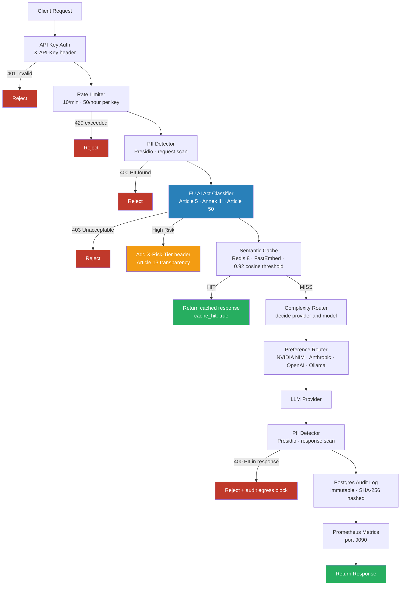

# nexus-ai-gateway


A **governed, production-style enterprise AI gateway** built with FastAPI, LiteLLM, and Redis — demonstrating solution architecture across multi-provider LLM routing, EU AI Act compliance, semantic caching, PII protection, and full audit logging.

---

## What this is

`nexus-ai-gateway` is a governed API gateway that sits in front of multiple LLM providers (OpenAI, Anthropic, Ollama, and NVIDIA NIM) and enforces enterprise-grade controls on every request:

- **Every request is classified** against the EU AI Act's four risk tiers before reaching an LLM
- **Every request is screened** for PII using Microsoft Presidio — detect-and-reject, never scrub-and-forward
- **Every response is audited** — immutable Postgres records with SHA-256 integrity hashing
- **Repeated questions are cached** semantically using Redis 8 vector search and FastEmbed embeddings
- **Every caller is authenticated** and rate-limited per API key

---

## Architecture

The request pipeline enforces governance controls in strict order:


---

## Quick start

**Prerequisites:** Docker Desktop, Git, API keys for OpenAI and Anthropic.

```bash
# 1. Clone and configure
git clone https://github.com/YOUR_USERNAME/nexus-ai-gateway.git
cd nexus-ai-gateway
cp .env.example .env          # add your API keys

# 2. Start the stack
docker compose up --build

# 3. Send a request
curl -X POST http://localhost:8000/chat \
  -H "Content-Type: application/json" \
  -H "X-API-Key: your-api-key" \
  -d '{"messages":[{"role":"user","content":"What is a RAG pipeline?"}],
       "model_preference":"auto","max_tokens":200,"stream":false,
       "user_id":"demo","session_id":"s1","metadata":{}}'
```

---

## Governance features

| Feature | Implementation | Standard |
|---|---|---|
| EU AI Act risk classification | 4-tier keyword/intent heuristic | Article 5, Annex III, Article 50 |
| Article 13 transparency | `X-Risk-Tier` response header on High Risk | EU AI Act Article 13 |
| PII detection — request | Microsoft Presidio, detect-and-reject | GDPR Article 5, EU AI Act Article 10 |
| PII detection — response | Asymmetric entity list, egress block | GDPR data minimisation |
| Immutable audit log | Postgres, SHA-256 integrity hash, frozen Pydantic model | SOC 2 Type II alignment |
| API key authentication | FastAPI Security dependency, `X-API-Key` header | OWASP API Security Top 10 |
| Per-key rate limiting | slowapi + Redis, 10/min · 50/hour | Credit protection, fair use |

---

## Technical stack

| Layer | Technology |
|---|---|
| API framework | FastAPI 0.100+ |
| LLM routing | LiteLLM (OpenAI, Anthropic, Ollama, NVIDIA NIM) |
| Semantic cache | Redis 8 vector search, FastEmbed `BAAI/bge-small-en-v1.5` |
| PII detection | Microsoft Presidio + spaCy `en_core_web_lg` |
| Audit log | Postgres 16, asyncpg |
| Observability | Prometheus (port 9090), structured JSON logging |
| Rate limiting | slowapi, Redis-backed |
| Containerisation | Docker, multi-stage build, non-root user |

---

## Design decisions

Key architectural decisions are documented as Architecture Decision Records:

- [ADR-001 — Semantic cache: FastEmbed over sentence-transformers](docs/adr/ADR-001-semantic-cache.md)
- [ADR-002 — PII: detect-and-reject over scrub-and-forward](docs/adr/ADR-002-pii-detect-reject.md)
- [ADR-003 — EU AI Act: keyword heuristic over LLM-based classification](docs/adr/ADR-003-eu-ai-act-classifier.md)
- [ADR-004 — Audit log: synchronous Postgres write over Redis Streams](docs/adr/ADR-004-sync-audit-write.md)
- [ADR-005 — NVIDIA Nemotron: dual-path provider (hosted NIM + local Ollama)](docs/adr/ADR-005-nvidia-nim-provider.md)

See also:
- [SCALING.md](docs/SCALING.md) — bottlenecks, scaling strategy, Cloud Run architecture
- [COST_MODEL.md](docs/COST_MODEL.md) — cost per request, cache savings, budget controls

---

## Running tests

```bash
# Inside the container (full suite including integration tests)
docker exec -it nexus-ai-gateway pytest -v

# On the host (unit tests only)
pytest -v tests/unit/
```

91 tests — unit + integration, covering all governance gates, routing logic,
fallback chains, semantic cache, audit log, and authentication.

## Author

Built by a GenAI Solution Architect with ~10 years of TPM and AI/ML delivery
experience across consulting and GCC environments in India, targeting
Solution Architect roles.

Regulatory knowledge: EU AI Act (Regulation 2024/1689)

---

*MIT License · Built with FastAPI, LiteLLM, Redis, Postgres, Presidio*